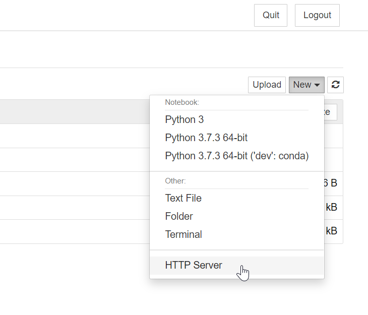

# jupyter-http-server

A simple HTTP server for Jupyter Notebook / Lab. It adds a button to the classic / lab UI that lets you start an HTTP server in order to preview any HTML files that are in your folders.

## Install and use

To use this package, simply instally it directly from the `main` branch:

```bash
pip install git+https://github.com/choldgraf/jupyter-http-server
```

You will then see a button in the classic notebook UI to launch an HTTP server:



## Using with JupyterLab

If you'd like a button to show up in JupyterLab that opens up the HTTP server, simply install this
package, and then install the JupyterLab server-proxy extension:

```bas
jupyter labextension install @jupyterlab/server-proxy
```

You should then see an `HTTP Server` button show up in your JupyterLab launch buttons.

## Notes


This is a very simple implementation of an HTTP server that works with [jupyter-server-proxy](https://jupyter-server-proxy.readthedocs.io).

It followed [the guidelines for starting/proxying processes](https://jupyter-server-proxy.readthedocs.io/en/latest/server-process.html)
